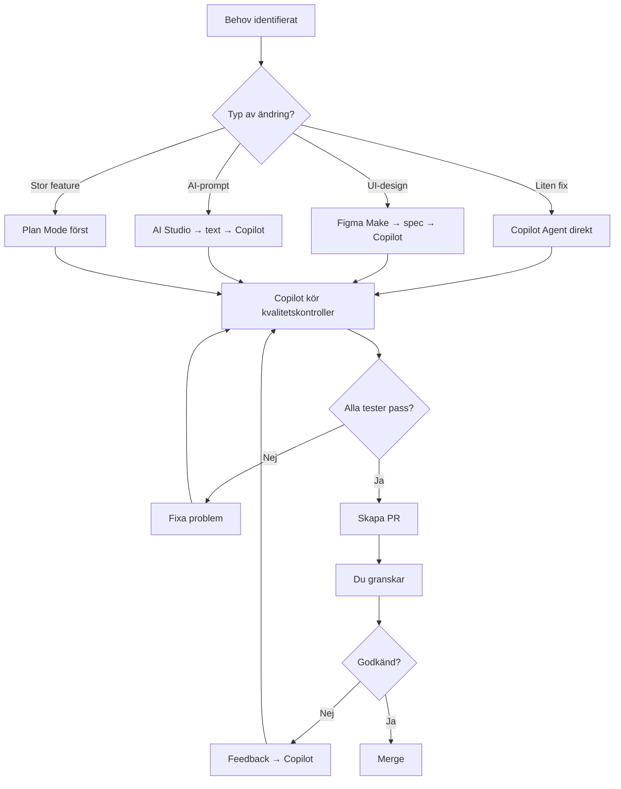

# Development Governance: En Väg Framåt

**Datum:** 2026-04-01
**Version:** 1.0
**Status:** Aktiv policy

---

## Sammanfattning

Detta dokument etablerar tydliga rutiner och processer för att säkerställa att all utveckling följer samma spår och undviker sidospår som skapar teknisk skuld.

**Kärnprincip:** En AI-agent commitar, alla andra ger input.

---

## 1. Gyllene Regler

### 1.1 Commit-regler

✅ **EN AI commitar kod:**
- GitHub Copilot Agent är den ENDA AI som får göra commits till repot
- Google AI Studio levererar TEXT/specifikationer → du ger till Copilot Agent
- Figma Make levererar DESIGN-specifikationer → du ger till Copilot Agent
- Cursor/VS Code används för lokala fixar → synkas sedan via Copilot Agent

❌ **Förbjudet:**
- AI Studio får INTE commita direkt
- Figma Make får INTE commita direkt
- Stitch får INTE göra branch-operationer
- Ingen "quick fix" som hoppar över kvalitetskontroller

### 1.2 Kvalitetsgrindar

**Innan varje commit MÅSTE följande passera:**
```bash
npm run typecheck  # 0 TypeScript-fel
npm run lint       # 0 ESLint-fel
npm run test:unit  # Alla unit-tester passing
```

**Innan PR merge MÅSTE följande passera:**
```bash
npm run test:component  # Alla component-tester passing
npm run format:check    # Alla filer korrekt formaterade
```

### 1.3 Human-in-the-Loop

**Du (JbmbAb) MÅSTE godkänna:**
- Alla PRs innan merge
- Alla nya moduler/services
- Alla arkitektoniska beslut
- Alla externa integrationer
- Alla säkerhetsrelaterade ändringar

---

## 2. Workflow för Kodändringar

### 2.1 Standard-workflow



### 2.2 Kommandosekvens för Copilot Agent

**För varje kodändring:**

1. **Förstå uppgiften**
   ```
   Läs requirement
   Analysera påverkan
   Identifiera berörda moduler
   ```

2. **Planera (om komplex)**
   ```
   Använd EnterPlanMode för features
   Skapa implementation checklist
   Få godkännande från användare
   ```

3. **Implementera**
   ```
   Gör ändringar
   Kör tester kontinuerligt
   Uppdatera relaterad dokumentation
   ```

4. **Kvalitetskontroll**
   ```bash
   npx tsc --noEmit
   npx eslint .
   npx vitest run
   ```

5. **Commit**
   ```bash
   git add .
   git commit -m "feat: beskrivning

   🤖 Generated with Claude Code
   Co-Authored-By: Claude Sonnet 4.5 <noreply@anthropic.com>"
   ```

6. **Skapa PR**
   ```
   Använd create_pull_request tool
   Inkludera:
   - Summary av ändringar
   - Test plan
   - Breaking changes (om några)
   ```

---

## 3. Modulstruktur och Ägandeskap

### 3.1 Ägarskap per Kategori

| Kategori | Ansvarig | Beslut krävs från |
|----------|----------|-------------------|
| **Domain Models** | Copilot Agent | JbmbAb (arkitektur) |
| **API Contracts** | Copilot Agent | JbmbAb (breaking changes) |
| **Services** | Copilot Agent | JbmbAb (nya services) |
| **UI Components** | Figma Make + Copilot | JbmbAb (nya features) |
| **Tests** | Copilot Agent | Automatiskt (CI) |
| **Documentation** | Alla (AI Studio OK) | JbmbAb (strategi-docs) |
| **Infrastructure** | Copilot Agent | JbmbAb (alltid) |

### 3.2 Förbjudna Operationer

❌ **Får ALDRIG göras utan explicit godkännande:**

1. **Ta bort databastabeller** eller kolumner i produktion
2. **Ändra API-kontrakt** som bryter backwards compatibility
3. **Ta bort tester** (förutom vid refactoring där nya tester ersätter)
4. **Inaktivera säkerhetskontroller** (RBAC, GDPR, audit)
5. **Hardkoda credentials** eller hemligheter
6. **Hoppa över migrations** vid schema-ändringar
7. **Commita direkt till main** (endast via PR)
8. **Merge utan godkända tester**

### 3.3 Tillåtna Autonoma Operationer

✅ **Copilot Agent får göra utan förfrågan:**

1. **Fixa TypeScript-fel** som blockar build
2. **Fixa ESLint-warnings** enligt projekt-regler
3. **Uppdatera tester** som är röda efter legitima kodändringar
4. **Formatera kod** enligt Prettier-regler
5. **Lägga till unit-tester** för otestade funktioner
6. **Uppdatera inline-dokumentation** (JSDoc, kommentarer)
7. **Refaktorera** utan att ändra beteende (med tester som bevis)

---

## 4. Förhindra Sidospår

### 4.1 Tidiga Varningssignaler

🚨 **Stoppa omedelbart om:**

- Ny kod duplicerar befintlig funktionalitet
- Ny modul saknar tydligt ansvar
- Ny feature saknar tester
- Temporär lösning utan plan för permanent fix
- Experimentell kod läggs i produktions-path
- Demo/POC-kod blandas med produkt-kod

### 4.2 Spår-validering per PR

**Varje PR måste besvara:**

1. ✅ **Syfte:** Varför görs denna ändring?
2. ✅ **Omfattning:** Vilka moduler påverkas?
3. ✅ **Testning:** Hur verifieras beteendet?
4. ✅ **Dokumentation:** Uppdaterad vid behov?
5. ✅ **Breaking Changes:** Identifierade och motiverade?
6. ✅ **Legacy-påverkan:** Kommer gammal kod att röras?

**Template för PR-beskrivning:**
```markdown
## Syfte
[Beskriv vad och varför]

## Ändringar
- [Lista huvudsakliga ändringar]

## Test Plan
- [ ] Unit tests pass
- [ ] Component tests pass
- [ ] Manual testing: [beskriv]

## Checklist
- [ ] TypeScript 0 errors
- [ ] ESLint 0 errors
- [ ] Alla tester passing
- [ ] Dokumentation uppdaterad
- [ ] Inget duplicerad kod
- [ ] Följer modulregistret
```

### 4.3 Arkivering av Sidospår

**Om sidospår upptäcks:**

1. **Identifiera:** Markera modulen som "experimentell" i modulregistret
2. **Isolera:** Flytta till `legacy/experimental/`
3. **Dokumentera:** Förklara varför den inte är i produktions-path
4. **Besluta:** Inom 30 dagar - integrera eller kassera

**Exempel på sidospår som redan identifierats:**
- `gpsTrackingService.ts` → Beslut väntar: integrera eller arkivera
- `marketIntelService.ts` → Beslut väntar: integrera eller arkivera
- `bankComplianceProfileService.ts` → Beslut väntar: integrera eller arkivera
- `app/routes/` (Remix) → **BESLUT TAGET:** Kassera

---

## 5. Synkroniseringsrutiner

### 5.1 Dagliga Rutiner

**Varje morgon innan arbete:**
```bash
# Lokalt (VS Code/Cursor)
git pull origin main

# Kontrollera status
npm run typecheck
npm run lint
npm test:unit
```

**Efter varje Copilot-session:**
```bash
# Copilot pushar automatiskt via report_progress
# Du granskar PR
# Merge när godkänd
```

### 5.2 Veckorutiner

**Varje måndag:**
- Review av öppna PRs (max 3 öppna samtidigt)
- Update av modulregister vid nya moduler
- Sync-meeting: Du + Copilot Agent (via prompt)

**Varje fredag:**
- Kör full test-suite: `npm run test`
- Kontrollera test-coverage: minst 70%
- Arkivera gamla branches

### 5.3 Sprint-rutiner (varannan vecka)

**Sprint start:**
- Prioritera features från backlog
- Skapa issues i GitHub (om används)
- Definiera acceptance criteria

**Sprint slut:**
- Demo av färdiga features
- Retrospektiv: vad fungerade/inte fungerade
- Uppdatera strategidokument vid behov

---

## 6. Konfliktlösning

### 6.1 Git-konflikter

**Om merge-konflikt uppstår:**

1. **Identifiera orsak:**
   - Parallella ändringar i samma fil?
   - Glömt att pusha/pulla?

2. **Lös lokalt:**
   ```bash
   git fetch origin
   git merge origin/main
   # Lös konflikter manuellt
   npm run test  # Verifiera
   git commit
   ```

3. **Förhindra framtida:**
   - Pull innan varje Copilot-session
   - Små, frekventa commits istället för stora batches

### 6.2 Arkitektoniska Konflikter

**Om ny kod krockar med befintlig arkitektur:**

1. **Pausa utveckling**
2. **Analysera:**
   - Är ny design bättre?
   - Ska gammal design uppdateras?
   - Kan båda samexistera tillfälligt?

3. **Besluta:**
   - Du (JbmbAb) tar arkitektoniskt beslut
   - Dokumentera i `docs/architecture/decisions/`
   - Uppdatera modulregister

4. **Implementera:**
   - Följ vald riktning konsekvent
   - Migrera gamla moduler vid behov

### 6.3 Kvalitetskonflikter

**Om tester vs. funktionalitet krockar:**

**Princip:** Tester beskriver önskat beteende.

- Om test är fel → uppdatera test
- Om kod är fel → fixa kod
- Om bägge är fel → skriv om från requirement

**Aldrig:**
- Ta bort test för att "det är rött"
- Skippa test för att "det går inte att testa"
- Mock:a för mycket så test blir meningslösa

---

## 7. Dokumentationskrav

### 7.1 Vad Måste Dokumenteras

**Vid ny modul:**
```typescript
/**
 * [Modulnamn]
 *
 * Syfte: [Kortfattad beskrivning]
 * Ansvar: [Vad gör denna modul]
 * Dependencies: [Externa beroenden]
 * Human-in-the-loop: [Ja/Nej, var i flödet]
 *
 * @example
 * const result = await newModule.doSomething();
 */
```

**Vid ny API-endpoint:**
```typescript
/**
 * POST /api/v2/resource
 *
 * @description [Vad gör denna endpoint]
 * @auth Required - CONSULTANT, ADMIN
 * @input ResourceCreateSchema (Zod)
 * @output ResourceResponse
 * @throws 400 - Invalid input
 * @throws 403 - Unauthorized
 * @throws 500 - Server error
 */
```

**Vid complex affärslogik:**
```typescript
// Compliance Rule: MB 2 kap 3 §
// Om verksamhet är över X ton och inom Y meter från vattendrag
// krävs förhöjd nivå av recipientskydd.
// Källa: Naturvårdsverket 2010:1, sid 17
```

### 7.2 Living Documents

**Dessa dokument ska hållas uppdaterade:**

| Dokument | När uppdatera | Ansvarig |
|----------|---------------|----------|
| **modulregister_ombyggnad.md** | Vid nya/borttagna moduler | Copilot Agent |
| **ombyggnadsstrategi_bygga_nytt_bygga_ratt.md** | Vid arkitektur-beslut | JbmbAb + Copilot |
| **development-governance.md** (detta doc) | Vid process-ändringar | JbmbAb |
| **PRODUCTION_STATUS.md** | Efter varje deployment | Copilot Agent |
| **AGENTS.md** | Vid nya AI-verktyg | JbmbAb |

---

## 8. Eskalering och Beslutspunkter

### 8.1 Vem Beslutar Vad

**Nivå 1: Autonoma beslut (Copilot Agent)**
- Bugfixes som inte ändrar beteende
- Testfall för befintlig funktionalitet
- Kodformatering och linting
- Uppdatering av dependencies (minor versions)

**Nivå 2: Snabba beslut (Du inom samma dag)**
- Nya utility-funktioner
- Nya komponenter inom befintlig feature
- Refactoring av enskild modul
- Uppdatering av dependencies (major versions)

**Nivå 3: Strategiska beslut (Du efter analys)**
- Nya features/moduler
- API-kontraktsändringar
- Database schema-ändringar
- Externa integrationer
- Arkitektoniska omdesigner

**Nivå 4: Kritiska beslut (Du + eventuellt extern rådgivning)**
- Säkerhetsrelaterade ändringar
- GDPR-påverkande ändringar
- Deployment-strategi
- Licensval för dependencies

### 8.2 Eskaleringsprocess

**Om Copilot Agent är osäker:**

1. **Pausa arbetet**
2. **Beskriv dilemmat:**
   ```
   Option A: [Beskrivning + för/nackdelar]
   Option B: [Beskrivning + för/nackdelar]
   Rekommendation: [X eftersom Y]
   ```
3. **Vänta på ditt beslut**
4. **Fortsätt baserat på beslut**
5. **Dokumentera i ADR** (Architecture Decision Record)

---

## 9. Kvalitetsmätning

### 9.1 Kontinuerliga Mätetal

**Daglig övervakning:**
```bash
# Kör dessa automatiskt i CI/CD
npm run typecheck     # Mål: 0 errors
npm run lint          # Mål: 0 errors
npm run test          # Mål: 100% passing
npm run format:check  # Mål: 0 warnings
```

**Veckovis rapportering:**
```bash
# Test coverage
npm run test:coverage
# Mål: >70% statements, >60% branches

# Bundle size
npm run build
# Mål: <500KB gzipped
```

### 9.2 Kvalitets-gates

**Före merge till main:**
- ✅ All tester passing (1444+ tester)
- ✅ Coverage inte sänkt
- ✅ 0 TypeScript errors
- ✅ 0 ESLint errors
- ✅ PR godkänd av JbmbAb
- ✅ Alla CI-checks gröna

**Före deployment till produktion:**
- ✅ Alla quality-gates från merge
- ✅ Integration-tester körda
- ✅ Database migrations testade
- ✅ Rollback-plan dokumenterad
- ✅ Juridisk review (vid GDPR-påverkan)

---

## 10. Checklista: Är Vi På Rätt Spår?

### 10.1 Varje Vecka - Självutvärdering

**Ställ dessa frågor:**

- [ ] Har alla commits gått via Copilot Agent (EN AI)?
- [ ] Har alla PRs granskats och godkänts innan merge?
- [ ] Finns det nya moduler som saknas i modulregistret?
- [ ] Finns det experimentell kod i produktions-path?
- [ ] Har alla tester körts och är gröna?
- [ ] Är dokumentationen synkad med koden?
- [ ] Finns det öppna branches äldre än 2 veckor?
- [ ] Har alla nya features tester?
- [ ] Följer koden arkitekturen i strategidokumentet?
- [ ] Är alla kritiska beslut dokumenterade?

**Om NEJ på någon fråga → Åtgärda omedelbart**

### 10.2 Varje Månad - Djupgranskning

**Gör en fullständig review:**

1. **Kodbasen:**
   - Kör `npm run test:coverage` → Kontrollera trend
   - Kör code-review på största PRs senaste månaden
   - Identifiera duplicerad kod med verktyg

2. **Dokumentation:**
   - Läs igenom strategidokument → Stämmer de fortfarande?
   - Uppdatera modulregister → Nya moduler? Arkiverade?
   - Review av ADRs → Följs besluten?

3. **Process:**
   - Hur många konflikter uppstod?
   - Hur många sidospår skapades?
   - Följs governance-reglerna?

4. **Planering:**
   - Behöver strategin justeras?
   - Nya hot/möjligheter?
   - Är vi på rätt väg mot ombyggnadsmålen?

---

## 11. Snabbreferens

### 11.1 Kommandosats för Utvecklare

```bash
# Morgonrutin
git pull origin main
npm ci  # Om package-lock.json ändrats
npm run typecheck && npm run lint && npm run test:unit

# Under arbete (körs av Copilot Agent automatiskt)
npx tsc --noEmit
npx eslint .
npx vitest run

# Innan commit (görs av Copilot Agent)
npm run format
npm run test

# Kvällsrutin
git status  # Inget ska vara uncommitted
```

### 11.2 Beslutsflöde

```
Förändring identifierad
    ↓
Är det en bugg?
    ├─ Ja → Copilot fixar direkt
    └─ Nej → Är det en ny feature?
        ├─ Ja → Plan mode → Godkännande → Implementera
        └─ Nej → Är det arkitektonisk?
            ├─ Ja → Diskussion → ADR → Implementera
            └─ Nej → Eskalera till JbmbAb
```

### 11.3 Akutlista

**Om något går fel:**

1. **Build failar:**
   ```bash
   git log -1  # Senaste commit
   git revert HEAD  # Om nödvändigt
   npm run typecheck  # Identifiera problem
   ```

2. **Tester failar:**
   ```bash
   npm run test -- --reporter=verbose
   # Fixa identifierade problem
   # Commit fix
   ```

3. **Merge konflikt:**
   ```bash
   git fetch origin
   git merge origin/main
   # Lös konflikter i VS Code
   npm run test  # Verifiera
   git commit
   ```

4. **Produktion failar:**
   ```bash
   # Rollback omedelbart
   git revert <problematic-commit>
   git push origin main
   # Analysera problem offline
   ```

---

## 12. Sammanfattning: En Väg Framåt

### Kärnprinciper:

1. ✅ **EN AI commitar** - GitHub Copilot Agent
2. ✅ **Human-in-the-loop** - Du godkänner alla PRs
3. ✅ **Kvalitet först** - Inga kompromisser på tester
4. ✅ **Tydliga ansvarsområden** - Modulregistret är sanning
5. ✅ **Dokumentation synkad** - Kod och docs matchar alltid
6. ✅ **Kontinuerlig reflektion** - Vecko- och månadsgranskningar
7. ✅ **Snabb eskalering** - Vid tveksamhet, fråga omedelbart
8. ✅ **Ingen big-bang** - Stegvis, verifierad förändring

### Framgångsindikatorer:

- ✅ 0 TypeScript errors
- ✅ 0 ESLint errors
- ✅ 1444+ tester passing
- ✅ >70% test coverage
- ✅ 0 sidospår i produkt-kod
- ✅ Alla experimentella moduler arkiverade eller integrerade
- ✅ Strategidokument följs

### Misslyckandetecken:

- ❌ Flera AI:er commitar parallellt
- ❌ Tester skipas "för att spara tid"
- ❌ Dokumentation är föråldrad
- ❌ Sidospår växer okontrollerat
- ❌ Konflikter uppstår dagligen
- ❌ Strategin ignoreras

---

**Med dessa rutiner och processer på plats finns nu en tydlig väg framåt där alla följer samma spår.**

---

**Dokumentägare:** JbmbAb + GitHub Copilot Agent
**Senast uppdaterad:** 2026-04-01
**Nästa review:** 2026-05-01 (månatlig)
**Status:** ✅ AKTIV POLICY
