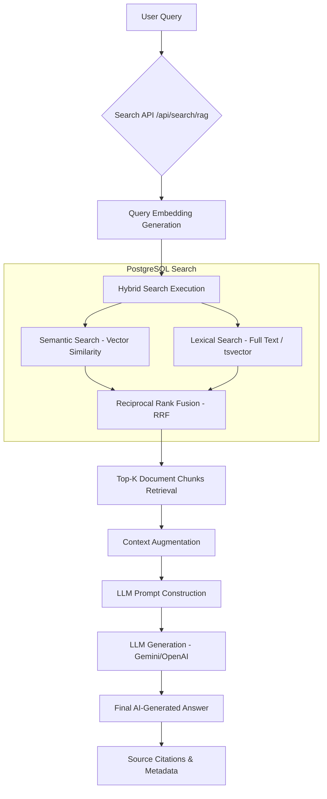

# RAG Search Architecture

This document describes the Retrieval-Augmented Generation (RAG) flow used in the Miljöbeslut platform for legal and environmental searches.

## Flow Diagram

## Key Components

1.  **Embedding Generation:** Converts the user query into a numerical vector using a transformer model.
2.  **Hybrid Search:** Combines traditional keyword matching (Lexical) with semantic meaning (Vector) to ensure high recall and precision.
3.  **RRF (Reciprocal Rank Fusion):** Merges results from different search algorithms into a single ranked list.
4.  **Context Augmentation:** Selects the most relevant document segments ("chunks") to provide the LLM with ground truth.
5.  **Citations:** Every fact in the AI answer is linked back to a `DocumentRecord` or `RequirementRecord` for legal accountability.
