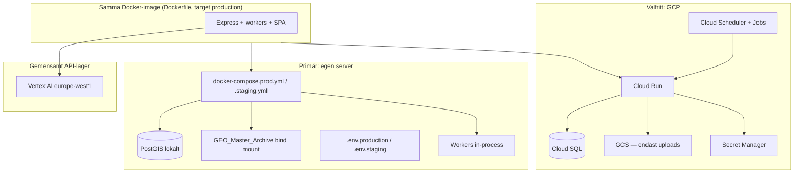

# Lokalt först — GCP valfritt

**Beslut (team):** Primär drift sker på **egen server** (Docker + PostGIS). **Google Cloud** behålls som **alternativ deploy-target** för staging/prod — samma container, olika miljövariabler. Geo- och dokumentarkiv följer **Mimers Brunn** (offline-first, canonical paths lokalt).

Relaterat: [postgis-docker-drift.md](postgis-docker-drift.md), [DEPLOY_GCP.md](../deploy/DEPLOY_GCP.md), [GCP_P2_PLATFORM.md](../deploy/GCP_P2_PLATFORM.md), [staging-observability-secrets.md](staging-observability-secrets.md).

---

## Varför

| Motiv | Kommentar |
|-------|-----------|
| **Kostnad** | Egen server ~100–300 kr/mån (el) vs GCP prod ~2 500–4 500 kr/mån i fast infra |
| **Data** | Master Archive och harvesting-pipelines är redan lokala (`H:\...\GEO_Master_Archive`) |
| **GDPR / kontroll** | Miljödata och käll-PDF:er under egen fysisk kontroll |
| **Flexibilitet** | GCP-pipeline (`cloudbuild.yaml`, GitHub Actions) finns kvar om kommun eller Google kräver molndrift |

Vertex AI anropas från **båda** miljöer — det är den enda molntjänst som alltid kan vara aktiv.

---

## Arkitektur



**Gyllene regel:** Flytta **inte** Master Archive eller bulk geo/raster till GCS “för enkelhet”. Molnet tar app, DB och valfria uploads — inte terabyte arkiv.

---

## Vad som körs var

| Område | Egen server (primär) | GCP (när aktiverat) |
|--------|----------------------|---------------------|
| App | `docker-compose.prod.yml` | Cloud Run (`cloudbuild.yaml`) |
| PostgreSQL + PostGIS | Container `db` i compose | Cloud SQL |
| Uppladdade dokument | `storage/uploads` (ingen bucket) | `GCS_DOCUMENTS_BUCKET` |
| Legal/geo-källor | `KNOWLEDGE_BASE_ROOT`, `IMPORT_ARCHIVE_ROOT` | Samma paths via mount — **inte** GCS bulk |
| Bakgrundsjobb | `SEARCH_WORKER_ENABLED=true`, cron in-process | `SEARCH_WORKER_ENABLED=false` + Scheduler |
| Hemligheter | `.env.production` (fil på server, ej i git) | Secret Manager |
| Observability | JSON-loggar → fil/Loki/Grafana | Cloud Logging |
| AI (rerank, RAG) | Vertex via ADC eller SA JSON | Vertex via runtime service account |
| Deploy | `docker compose up -d --build` | GitHub Actions / `gcloud run deploy` |

Kodbasen växlar redan beteende via env — se `.env.example` och [readinessService.ts](../../server/services/readinessService.ts) (varning om GCS vs lokal lagring).

---

## Miljövariabler — två profiler

### Lokal staging (`docker-compose.staging.yml`, port 8787)

```env
NODE_ENV=production
PORT=8787
DATABASE_URL=postgresql://miljobeslut:password@db:5432/miljobeslut_staging

# In-process workers (ingen Cloud Scheduler)
SEARCH_WORKER_ENABLED=true
GDPR_CRON_IN_PROCESS=true
START_WORKERS_IN_PROCESS=true

# Vertex — enda molntjänst
VERTEX_PROJECT_ID=miljointelligens
VERTEX_LOCATION=europe-west1
LEGAL_RERANKER=on
QUERY_HASH_SALT=<32+ tecken, rotera säkert>
QUERY_HASH_SALT_VERSION=v1

# GCS — lämna tom (lokal upload)
# GCS_DOCUMENTS_BUCKET=

# Arkiv (justera till er canonical path)
# KNOWLEDGE_BASE_ROOT=H:\Delade enheter\Miljöbeslut\GEO_Master_Archive\...
# IMPORT_ARCHIVE_ROOT=H:\Delade enheter\Miljöbeslut\GEO_Master_Archive
```

### GCP pilot (Cloud Run — staging/demo, inte primär prod)

Se [dual-track-a.md](dual-track-a.md), [DEPLOY_GCP.md](../deploy/DEPLOY_GCP.md) och [GCP_P2_PLATFORM.md](../deploy/GCP_P2_PLATFORM.md).

Auto-deploy efter CI på **`staging`-branch** kräver `STAGING_DEPLOY_ENABLED=true` (default: av).
**`main` deployeras inte till GCP.** Manuell pilot: GitHub Actions → Deploy – Google Cloud Run.

```env
DATABASE_URL=postgresql://...@/miljobeslut?host=/cloudsql/PROJECT:europe-west1:miljobeslut-db&sslmode=disable
GCS_DOCUMENTS_BUCKET=miljobeslut-documents-miljointelligens
SEARCH_WORKER_ENABLED=false
GDPR_CRON_IN_PROCESS=false
START_WORKERS_IN_PROCESS=false
VERTEX_PROJECT_ID=miljointelligens
VERTEX_LOCATION=europe-west1
# Secrets via Secret Manager — inte i plain env
```

---

## Checklista — lokal staging/prod

### 1. Förbered server

- [ ] Docker + Docker Compose installerat
- [ ] Minst 16 GB RAM rekommenderat (PostGIS + app)
- [ ] Disk: DB-volym + read-only mount till Master Archive
- [ ] Brandvägg: endast 443 (eller intern VPN) utåt

### 2. Starta staging

```powershell
cd C:\miljöbeslut   # eller motsvarande på servern
copy .env.example .env.staging
# Redigera .env.staging enligt tabellen ovan

docker compose -f docker-compose.staging.yml up -d --build
docker compose -f docker-compose.staging.yml exec app npx prisma migrate deploy
```

### 3. Montera arkiv (exempel)

Justera sökväg till er canonical Master Archive. På Linux-server:

```yaml
# Lägg till under services.app.volumes i compose vid behov:
volumes:
  - /mnt/geo_master:/data/geo_master:ro
```

Env:

```env
IMPORT_ARCHIVE_ROOT=/data/geo_master
KNOWLEDGE_BASE_ROOT=/data/geo_master/knowledge_base
```

### 4. TLS och URL

- [ ] Reverse proxy (Caddy/nginx) med Let's Encrypt
- [ ] Sätt `STAGING_BASE_URL=https://staging.erdomän.se`

### 5. Vertex-autentisering på servern

**Alternativ A (rekommenderat):** Service account JSON med minimal roll (`roles/aiplatform.user`), fil utanför git:

```env
GOOGLE_APPLICATION_CREDENTIALS=/run/secrets/vertex-sa.json
```

**Alternativ B (dev):** `gcloud auth application-default login` — endast för utvecklingsmaskin, inte prod.

### 6. Backup

- [ ] Daglig `pg_dump` till separat disk
- [ ] Dokumentera RPO/RTO internt
- [ ] Testa restore minst en gång per kvartal

### 7. Verifiering

```powershell
$env:STAGING_BASE_URL = "https://staging.erdomän.se"
npx vitest run tests/smoke/legal_rerank_staging.test.ts
curl.exe -s "$env:STAGING_BASE_URL/api/ready" | jq .
```

Bekräfta `/ready` → `database: ok`, `vertex: ok` (eller dokumenterad varning).

---

## GCP-vägen — behåll utan att drifta

Följande ska **finnas kvar i repot** men behöver **inte** vara aktivt:

| Artefakt | Syfte |
|----------|--------|
| [cloudbuild.yaml](../../cloudbuild.yaml) | CI/CD till Cloud Run |
| [deploy/gcp/](../../deploy/gcp/) | Manuell första deploy |
| [docs/deploy/DEPLOY_GCP.md](../deploy/DEPLOY_GCP.md) | Full GCP-guide |
| `.github/workflows/deploy-gcp.yml` | Automatisk deploy (secrets tomma tills aktivering) |
| [staging-observability-secrets.md](staging-observability-secrets.md) | Secret Manager + Cloud Run env |

**Aktivering av GCP** kräver explicit beslut: fakturering, GitHub secrets (`GCP_PROJECT_ID`, WIF, `_CLOUDSQL`, `_VPC_CONNECTOR`), och godkännande enligt [production-readiness-checklist.md](../qa/production-readiness-checklist.md).

---

## När GCP blir motiverat

| Trigger | Åtgärd |
|---------|--------|
| Kommun kräver molndrift / SLA | Aktivera Cloud Run + Cloud SQL enligt DEPLOY_GCP |
| Google for Startups-krediter ska utnyttjas | Minimal staging i GCP (`db-f1-micro`) — se [deploy/gcp/README.md](../../deploy/gcp/README.md) |
| Trafik överstiger en servers kapacitet | Skala upp egen HW **eller** migrera compute till GCP (data kvar lokalt) |
| Behov av hanterad DB-backup utan egen rutin | Cloud SQL med PITR |

Tills dess: **lokal drift räcker** för utveckling, pilot och human-in-the-loop enligt AGENTS.md.

---

## Kostnad (orienterande)

| Scenario | Ungefär/mån |
|----------|-------------|
| Egen server (har HW) + Vertex låg pilot | ~100–300 kr infra + ~200–1 000 kr Vertex |
| GCP staging minimal | ~500–1 000 kr |
| GCP prod enligt repo (min-instances, Cloud SQL 2 vCPU) | ~2 500–4 500 kr + Vertex |
| Master Archive i GCS | **Undvik** — 10 TB ≈ 2 000+ USD/mån lagring alone |

Detaljer: se diskussion i team — hybrid (lokal compute + Vertex) är avsedd modell.

---

## Kod- och arkitekturregler (håll GCP-vägen öppen)

1. **En Dockerfile, flera compose/deploy-filer** — duplicera inte app-logik per miljö.
2. **Env-styr beteende** — undvik hårdkodade `D:\` / `H:\` i ny kod; använd `IMPORT_ARCHIVE_ROOT` m.fl.
3. **Ingen GCP-specifik logik i affärskod** — GCS/Secret Manager ska vara adapters (redan mönster i readiness + upload).
4. **Workers:** stöd både in-process och HTTP cron (`/api/internal/background/*`).
5. **Health:** `/health` och `/ready` ska fungera identiskt lokalt och i Cloud Run.
6. **Vertex OAuth2** — ingen `GEMINI_API_KEY` för rerank (se [legal-reranker-rollout.md](legal-reranker-rollout.md)).

---

## Beslutshistorik

| Datum | Beslut |
|-------|--------|
| 2026-07-26 | Lokalt först (egen server + Docker). GCP kvar som valfri deploy-target. Master Archive stannar lokalt. Vertex AI gemensam molntjänst. |
| 2026-07-27 | **Alternativ A (dual-track):** Primär prod = egen server. GCP = staging/pilot. Auto-deploy GCP endast `staging`-branch + `STAGING_DEPLOY_ENABLED=true`; `main` triggar inte GCP. Se [dual-track-a.md](dual-track-a.md). |

---

## Snabbreferens — filer

| Fil | Roll |
|-----|------|
| [docker-compose.staging.yml](../../docker-compose.staging.yml) | Lokal staging |
| [docker-compose.prod.yml](../../docker-compose.prod.yml) | Lokal prod |
| [.env.production.example](../../.env.production.example) | Mall lokal prod |
| [dual-track-a.md](dual-track-a.md) | Beslut och deploy-regler (primär vs GCP) |
| [local-prod-setup.md](local-prod-setup.md) | Startguide egen server |
| [scripts/gcp/](../../scripts/gcp/) | Secret audit + sync till GCP pilot |
| [.env.example](../../.env.example) | Alla env-variabler |
| [cloudbuild.yaml](../../cloudbuild.yaml) | GCP deploy (dormant) |
| [docs/deploy/DEPLOY_GCP.md](../deploy/DEPLOY_GCP.md) | Aktivera GCP |
