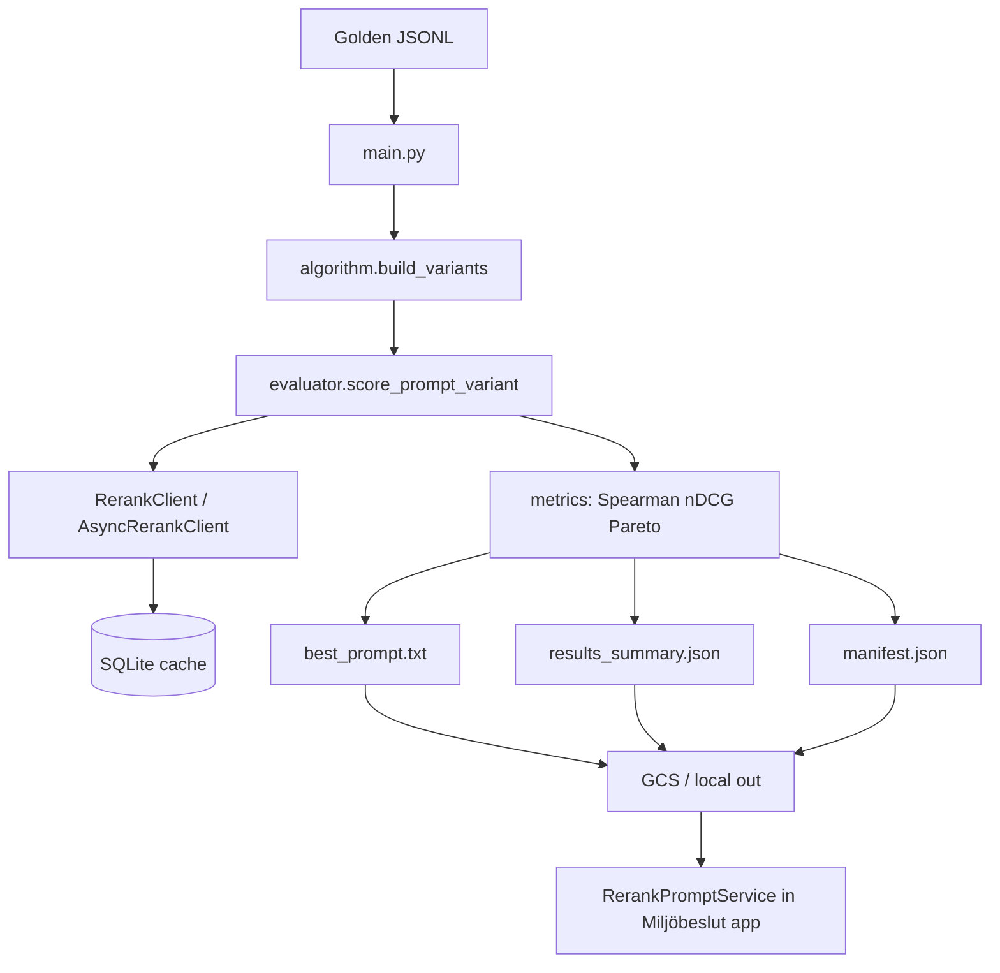

# Prompt Optimizer — Architecture

Production rerank prompt evaluation for Miljöbeslut. Replaces AlphaEvolve `list_deduplication` heuristic proxy with real rerank calls against a golden dataset.

## Module map (AlphaEvolve core)

| Module | Role | Depends on |
|--------|------|------------|
| `main.py` | CLI entrypoint, I/O orchestration, GCS upload | `algorithm`, `evaluator`, `config`, `manifest` |
| `algorithm.py` | Prompt variant generation (search space) | `rerank_client.DEFAULT_TEMPLATE` |
| `evaluator.py` | Public eval API (AlphaEvolve naming) | `eval.py` |
| `eval.py` / `eval_async.py` | Per-variant scoring loop | `cache`, `metrics`, `rerank_client` |
| `rerank_client.py` / `async_rerank_client.py` | Vertex / HTTP / mock rerank | `cache`, `rate_limiter` |
| `metrics.py` | Spearman, nDCG, Kendall, Pareto, bootstrap CI | — |
| `cache.py` | SQLite persistent cache + resume keys | `constants` |
| `config.py` | Pydantic settings (env / `.env`) | — |
| `manifest.py` | Reproducibility manifest (git, deps, golden hash) | `metadata` |

## Data flow

## External integration

| Consumer | Path |
|----------|------|
| Vertex Custom Job | `prompt_optimizer/Dockerfile` → `python main.py` |
| CI smoke | `.github/workflows/vertex_prompt_optimize.yml` |
| Prompt sync | `.github/workflows/vertex_prompt_updater.yaml` → `scripts/ci_update_and_smoke_test.sh` |
| App runtime | `server/services/rerankPromptService.ts` reads GCS `best_prompt.txt` |

## Related Miljöbeslut modules

| Area | Location |
|------|----------|
| AlphaEvolve GCP setup | `docs/alphaevolve/SETUP.md`, `scripts/alphaevolve/` |
| Legal search params experiment | `scripts/alphaevolve/experiments/legal_search_params/` |
| Golden dataset | `benchmarks/golden_v1_2000_records.jsonl` |
| Vertex job launcher (SDK) | `scripts/vertex_prompt_optimize.py` |
| CI quality gates | `scripts/ci_validate_results.py` |

## Outputs contract

See `README.md` for file list. `results_schema_version` and `cache_schema_version` gate backward compatibility.

## Security

- No secrets in repo; use GitHub Secrets (`GCP_SA_KEY`) and GCP Secret Manager in production.
- Rerank eval URL via `LEGAL_RERANK_EVAL_URL` (staging only).
- Mock mode: `MOCK_RERANK=1` for CI.
