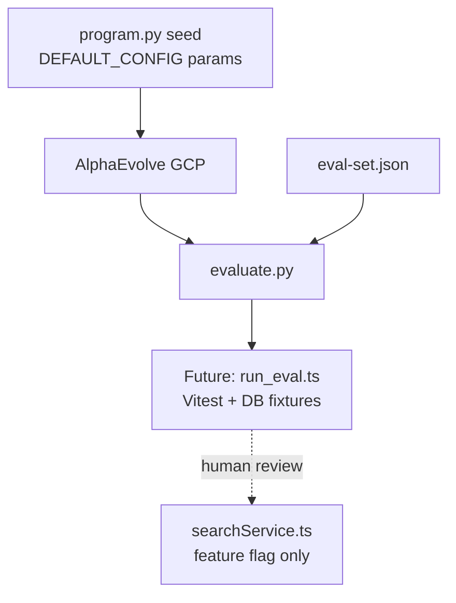

# Legal search params — AlphaEvolve experiment (design)

Evolve **hybrid legal retrieval parameters** against a fixed eval-set, aligned with production defaults in:

- [`server/services/searchService.ts`](../../../server/services/searchService.ts) — `DEFAULT_CONFIG`
- [`server/modules/ai/orchestrator/tools/searchLegalCorpusTool.ts`](../../../server/modules/ai/orchestrator/tools/searchLegalCorpusTool.ts) — RRF + reranker

## Status

| Phase | Scope | Status |
|-------|-------|--------|
| **Design** | Eval-set, constraints, local scorer | Done |
| **Phase 2** | `run_eval.ts` + fixtures → real RRF/rerank helpers | Done |
| **Integration** | Wire into AlphaEvolve cloud example | Planned |

## Architecture



## Files

| File | Purpose |
|------|---------|
| [`eval-set.json`](eval-set.json) | Fixed queries, term checks, param bounds |
| [`instructions.md`](instructions.md) | LLM instructions for evolution |
| [`src/program.py`](src/program.py) | Seed params (EVOLVE-BLOCK) + `evaluate()` |
| [`src/evaluate.py`](src/evaluate.py) | AlphaEvolve callback; local proxy scorer until DB hook |

## Local run (no GCP)

From Miljöbeslut repo root:

```powershell
npx vitest run scripts/alphaevolve/experiments/legal_search_params/tests
echo '{"RRF_K":60,"RRF_K_EXACT":30,"FTS_CANDIDATE_LIMIT":50,"VECTOR_CANDIDATE_LIMIT":50,"RRF_CANDIDATE_LIMIT":30,"RERANKER_FINAL_K":8,"LEGAL_RERANKER_RELATIVE_GAP":0.15,"rerankerEnabled":true}' | npx tsx scripts/alphaevolve/experiments/legal_search_params/run_eval.ts
python -c "import sys; sys.path.insert(0,'scripts/alphaevolve/experiments/legal_search_params'); from src.evaluate import legal_search_params_evaluation, INITIAL_PROGRAM_CODE; print(legal_search_params_evaluation({'content':{'files':[{'content':INITIAL_PROGRAM_CODE}]}}))"
```

## Primary metric

`neg_weighted_recall` — higher is better. Proxy scorer (design phase):

- +1 per eval case where all `must_include_terms` appear in synthetic hit text
- Penalty `-1000000` if params violate bounds in `eval-set.json`

**Phase 2** uses [`run_eval.ts`](run_eval.ts) with [`fixtures/eval-chunks.json`](fixtures/eval-chunks.json) and exported helpers from `searchLegalCorpusTool.ts` (RRF fusion + lexical rerank).

**Phase 3 (planned):** DB-backed golden run via Vitest/PostGIS instead of fixtures only.

## Prod merge policy

1. Evolved params documented in PR
2. `LEGAL_RERANKER` / config flag stays off until approved
3. CI green (unit + integration)
4. Human sign-off per AGENTS.md

## Related

- [docs/alphaevolve/EXPERIMENTS.md](../../../docs/alphaevolve/EXPERIMENTS.md)
- Working smoke example: `alphaevolve-on-googlecloud/examples/list_deduplication/`
