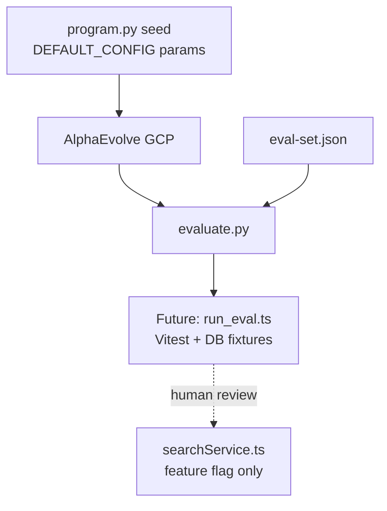

# Legal search params — AlphaEvolve experiment (design)

Evolve **hybrid legal retrieval parameters** against a fixed eval-set, aligned with production defaults in:

- [`server/services/searchService.ts`](../../../server/services/searchService.ts) — `DEFAULT_CONFIG`
- [`server/modules/ai/orchestrator/tools/searchLegalCorpusTool.ts`](../../../server/modules/ai/orchestrator/tools/searchLegalCorpusTool.ts) — RRF + reranker

## Status

| Phase | Scope | Status |
|-------|-------|--------|
| **Design** | Eval-set, constraints, local scorer | Done (this folder) |
| **Integration** | Wire `evaluate.py` → Vitest/PostGIS golden run | Planned |
| **AlphaEvolve cloud** | Copy pattern to `alphaevolve-on-googlecloud/examples/` | After integration |

## Architecture



## Files

| File | Purpose |
|------|---------|
| [`eval-set.json`](eval-set.json) | Fixed queries, term checks, param bounds |
| [`instructions.md`](instructions.md) | LLM instructions for evolution |
| [`src/program.py`](src/program.py) | Seed params (EVOLVE-BLOCK) + `evaluate()` |
| [`src/evaluate.py`](src/evaluate.py) | AlphaEvolve callback; local proxy scorer until DB hook |

## Local run (no GCP)

From Miljöbeslut repo root:

```powershell
cd scripts/alphaevolve/experiments/legal_search_params
python -m pytest tests -v
python -c "from src.evaluate import legal_search_params_evaluation, INITIAL_PROGRAM_CODE; print(legal_search_params_evaluation({'content':{'files':[{'content':INITIAL_PROGRAM_CODE}]}}))"
```

## Primary metric

`neg_weighted_recall` — higher is better. Proxy scorer (design phase):

- +1 per eval case where all `must_include_terms` appear in synthetic hit text
- Penalty `-1000000` if params violate bounds in `eval-set.json`

**Phase 2** replaces proxy with `run_eval.ts` calling `searchLegalCorpusHandler` against seeded fixtures (same pattern as [`tests/unit/searchLegalCorpusTool.test.ts`](../../../tests/unit/searchLegalCorpusTool.test.ts)).

## Prod merge policy

1. Evolved params documented in PR
2. `LEGAL_RERANKER` / config flag stays off until approved
3. CI green (unit + integration)
4. Human sign-off per AGENTS.md

## Related

- [docs/alphaevolve/EXPERIMENTS.md](../../../docs/alphaevolve/EXPERIMENTS.md)
- Working smoke example: `alphaevolve-on-googlecloud/examples/list_deduplication/`
